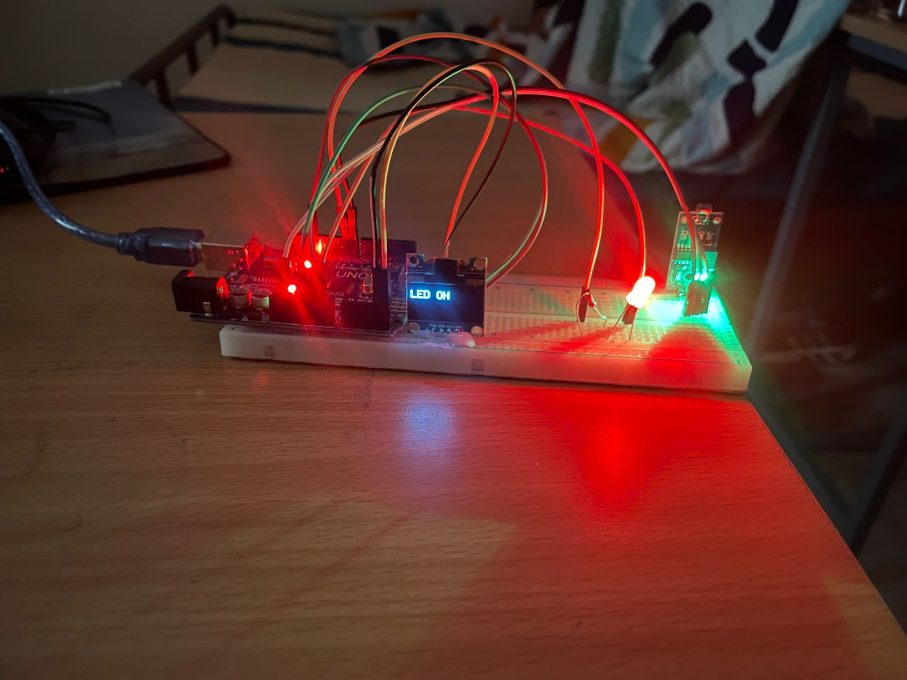
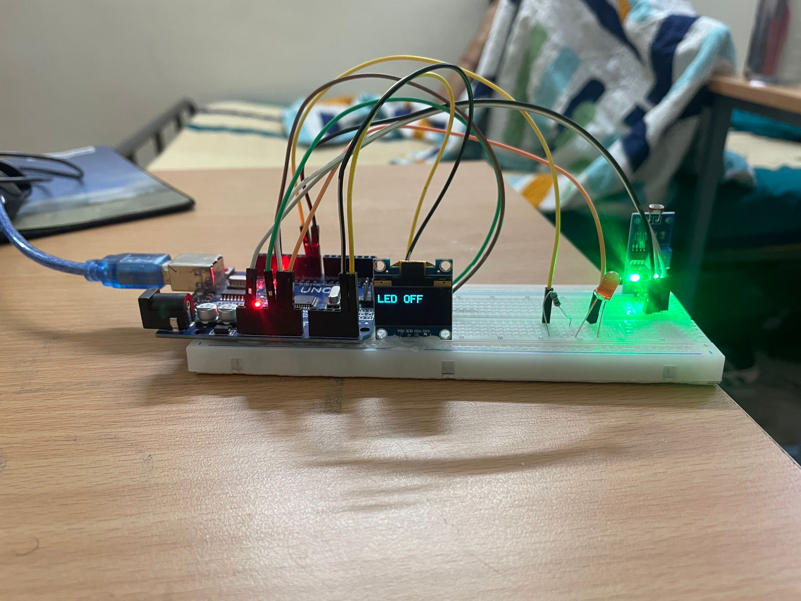

# LDR-Based LED Control with OLED Display

An Arduino UNO project that automatically controls LEDs based on ambient light detected by an LDR (Light Dependent Resistor), with real-time status shown on an OLED display.

## 📸 Demo

| LED ON (Dark) | LED OFF (Bright) |
|---|---|
|  |  |

## 🔧 Components

| Component | Quantity |
|---|---|
| Arduino UNO | 1 |
| LDR (Light Dependent Resistor) | 1 |
| SSD1306 OLED Display (128x64, I2C) | 1 |
| Red LED | 1 |
| Green LED | 1 |
| Resistors (220Ω for LEDs, 10kΩ for LDR) | As needed |
| Breadboard + Jumper Wires | — |

## 📌 Pin Connections

| Component | Arduino Pin |
|---|---|
| LDR (digital out) | D7 |
| LED 1 (Red) | D2 |
| LED 2 (Green) | D3 |
| OLED SDA | A4 |
| OLED SCL | A5 |
| OLED VCC | 3.3V / 5V |
| OLED GND | GND |

## 📚 Libraries Required

Install these via **Arduino IDE → Sketch → Include Library → Manage Libraries**:

- `Adafruit GFX Library`
- `Adafruit SSD1306`

## ⚙️ How It Works

- When the LDR detects **darkness** (LOW light) → Digital pin reads `HIGH` → LEDs turn **ON** → OLED displays **"LED ON"**
- When the LDR detects **brightness** (HIGH light) → Digital pin reads `LOW` → LEDs turn **OFF** → OLED displays **"LED OFF"**

## 🚀 Getting Started

1. Clone this repository:
   ```bash
   git clone https://github.com/roysempai/LDR-Sensor-OLED-based-Project.git
   ```
2. Open `ldr_led_oled.ino` in Arduino IDE
3. Install the required libraries
4. Connect the components as per the pin table above
5. Upload to your Arduino UNO

## 📄 License

MIT License
